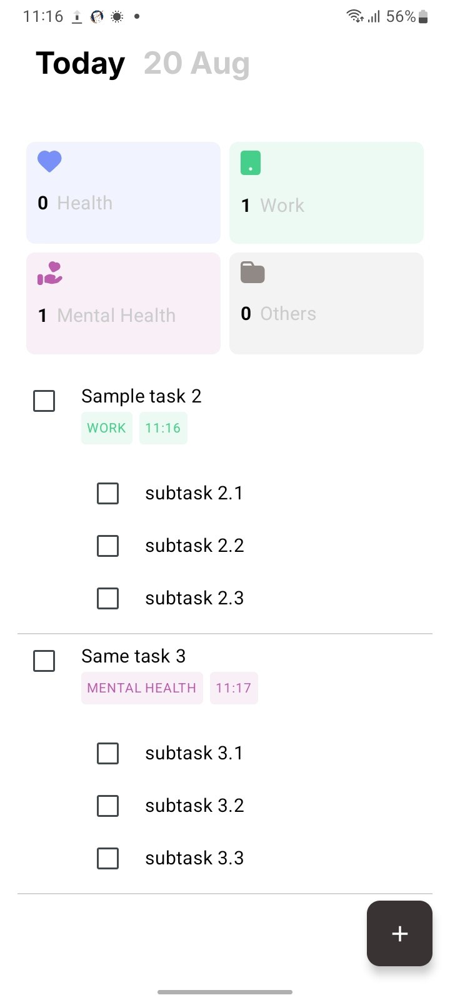
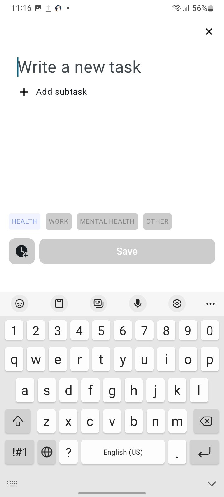
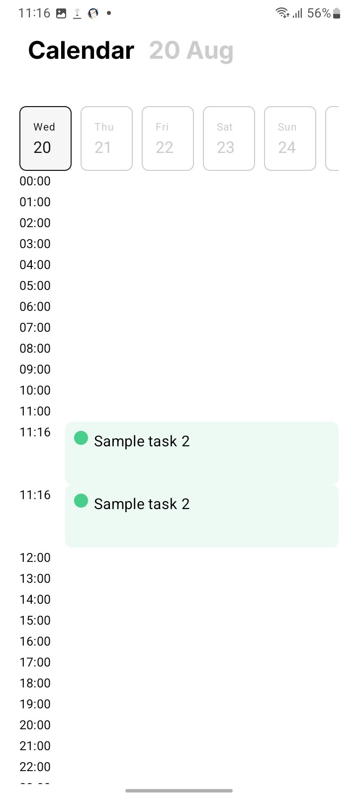

# ✅ Todo App – Jetpack Compose

A modern **Todo Application** built with **Android Jetpack Compose** and **MVI architecture** using the Orbit dependency.  
This app allows users to **create, update, delete, and manage todos** with a **calendar view** to visualize daily tasks.  
Users also receive **notifications at the exact time they scheduled tasks**, powered by **Broadcast Receivers**.

---

## ✨ Features
- 📝 Add, edit, delete, and manage tasks & subtasks  
- 📅 Calendar view for task scheduling  
- ⏰ Notifications when it’s time to complete a task (BroadcastReceiver)  
- 💾 Local persistence with **Room Database**  
- 🏗️ **MVI architecture** with Orbit for predictable state management  
- 🎨 Modern UI with Jetpack Compose  

---

## 📸 Screenshots

<p align="center">
  
  
  
</p>

---

## 🎥 Demo video


---

## 📲 Download

👉 [Download Latest APK](app-debug.apk)

---

## 🛠️ Tech Stack
- **Language:** Kotlin  
- **UI:** Jetpack Compose  
- **Architecture:** MVI (Orbit dependency)  
- **Database:** Room (DAO, Entities, TypeConverters)  
- **Notifications:** BroadcastReceiver + AlarmManager  
- **Dependency Injection:** Hilt / Manual (based on your DI setup)  

---

## 📂 Project Structure (inline)

- **app/** → Application class  
- **broadcast_receiver/** → Alarm receiver for task notifications  
- **data/** → Repository, Room database, DAOs, Entities, TypeConverters  
- **di/** → Dependency injection modules (repository, navigation, local, directions)  
- **domain/** → UI data models  
- **ui/** → Screens (Calendar, Todo list), components, ViewModels, contracts  
- **utils/** → Helpers, extensions  
- **MainActivity.kt** → Root activity  

---

## 🚀 Getting Started

1. **Clone the repo**  
   ```bash
   git clone https://github.com/ksanjardev/TodoApp.git
   cd TodoApp
